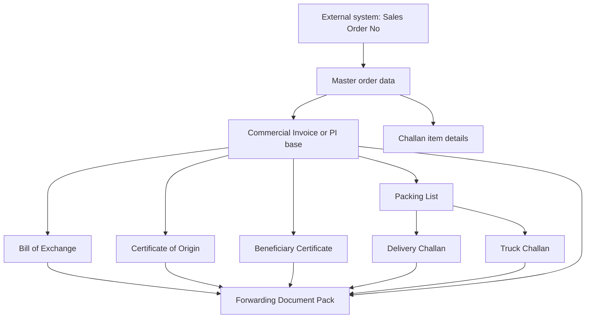

# ED Module Flow Understanding

## Big Picture

This workbook is not one single form.
It is a document pack for one export/shipment/order.

The sheets are being used in a chain:

1. Sales Order comes from another system
2. Commercial prepares the main commercial document
3. Item, quantity, buyer, bank, and LC data are reused across other sheets
4. Shipping and bank-support documents are generated from the same data
5. The full set is forwarded to bank / buyer / internal teams

So the real goal should be:

- enter one `Sales Order No`
- pull all order items automatically from another system
- fill one master data layer
- generate all required forms from that single source

## What Each Sheet Really Looks Like

### 1. `Challan Sheet`
This looks like the operational item source.

It contains:

- `PI NO`
- `Order Ref#`
- item descriptions
- delivery dates
- quantities
- challan numbers
- inspection result

This sheet is closest to production / delivery / QA history.
It looks like line-level order execution data, not just a print form.

### 2. `Commercial Invoice`
This looks like the main commercial master sheet inside the workbook.

It contains:

- invoice / PI number
- date
- L/C number and L/C date
- proforma reference
- buyer / consignee
- bank details
- item descriptions
- quantities
- unit price
- total amount

This is the most important sheet for document generation.
Several other sheets clearly depend on the same values.
From your latest note, this is also where the `Sales Order`-based item data appears to land automatically.

### 3. `Packing List`
This is the packing version of the same shipment.

It reuses:

- buyer / consignee
- bank
- item list
- quantities
- L/C details
- sales contract
- proforma invoice number
- transport mode

This sheet is basically the packaging/shipping breakdown for the same commercial transaction.

### 4. `Delivery Challan`
This is an internal / dispatch handover document.

It reuses data from:

- `Commercial Invoice`
- `Packing List`

Examples found in formulas:

- date from `Commercial Invoice`
- buyer from `Commercial Invoice`
- packing/LC/contract/proforma info from `Packing List`

So this sheet is downstream, not a starting point.

### 5. `Truck Challan`
This is another dispatch / transport document.

It also reuses:

- buyer from `Commercial Invoice`
- packing/L/C/contract/proforma data from `Packing List`

So this is another child document generated from the same shipment data.

### 6. `CERTIFICATE OF ORIGIN`
This is a support/export certificate.

It depends on:

- L/C information
- sales contract
- proforma invoice
- applicant details
- HS code

It is not a source form.
It is created after commercial data is finalized.

### 7. `BENEFICIARY'S CERTIFICATE`
This is also a support/export/bank document.

It contains a narrative summary of:

- total quantity
- total amount
- buyer
- bank
- L/C details
- applicant details
- sales contract
- proforma invoice

This is definitely a generated downstream document.

### 8. `Bill of exchange`
This is not the first form.
It is one of the final bank-negotiation documents.

It uses:

- amount in USD
- date
- L/C information
- sales contract
- applicant IRC/TIN/VAT/BIN
- beneficiary VAT/BIN
- HS code
- bank / consignee details

This means Bill of Exchange should be generated after the commercial amount and LC data are already confirmed.

### 9. `Forwarding`
This looks like the covering letter / submission sheet.

It lists the document pack:

- Bill of Exchange
- Commercial Invoice
- Packing List
- Delivery Challan
- Certificate of Origin
- Beneficiary Certificate
- Truck Challan
- Mushok Challan
- Original L/C

So this is near the final step, when the full document set is ready.

## Actual Scenario I Understand

The most likely business flow is this:

1. Buyer places order
2. Marketing receives order / buyer requirements
3. PI is prepared or confirmed
4. Sales Order details exist in another system
5. Commercial should enter `Sales Order No`
6. System should fetch:
   - buyer
   - sales order ref
   - item list
   - quantities
   - delivery dates
   - price
   - LC info
   - bank info
7. That data should populate the master commercial sheet
8. Other forms should be generated automatically from that same source
9. Marketing checks the PI / commercial details
10. Commercial prints the required export and dispatch documents
11. Production / dispatch uses challan-based documents
12. Bank/forwarding set is prepared at the end

## Best Document Hierarchy

This is the flow I would use:

## Important Understanding

### Bill of Exchange is not the source
From the workbook structure, `Bill of exchange` is downstream.
It should be generated from already-approved commercial and LC data.

### Commercial Invoice is the central form inside this workbook
This is the strongest candidate for the master commercial document in the current file.

### Challan Sheet is the operational source for item-level execution
It has the line items, dates, challan numbers, and quantities.
This looks like the best source for item rows if the other system does not already provide them cleanly.

### Packing List is a major reuse layer
Several later forms reference values that are also present in Packing List.

## What Seems Missing Right Now

The workbook appears to be mostly a template pack with many hardcoded values and only a few internal Excel formulas.

That means right now it is likely:

- partially manual
- partially copy-paste
- not truly driven by one input field

So if your goal is:

`enter sales order -> everything auto fills`

then the workbook still needs a proper source/data-entry design.

## Recommended Future Design

To make this usable, I would structure it like this:

### Step 1: One Input Sheet
Create one sheet called something like `Input` or `Order Fetch`.

Fields:

- Sales Order No
- PI No
- Buyer
- Buyer address
- Consignee
- Consignee bank
- L/C No
- L/C Date
- Sales Contract No
- Proforma Date
- Transport mode
- Factory
- Applicant tax/license fields

### Step 2: One Item Table
Auto-load all items for that sales order:

- item description
- specification
- ply/type
- quantity
- unit price
- amount
- delivery date
- challan no
- inspection result

### Step 3: All Print Sheets Reference Only the Input Sheet and Item Table
Then:

- `Commercial Invoice`
- `Packing List`
- `Delivery Challan`
- `Truck Challan`
- `Bill of exchange`
- `CERTIFICATE OF ORIGIN`
- `BENEFICIARY'S CERTIFICATE`
- `Forwarding`

should all read from the same source sheet, not from manual typing.

## Simplified Department Flow

1. Buyer gives order
2. Marketing creates or confirms PI
3. Commercial enters `Sales Order No`
4. System fetches all order data from external system
5. Commercial reviews master data
6. Commercial Invoice / PI base is generated
7. Packing and challan documents are generated
8. Marketing checks commercial details
9. Production/dispatch uses challan-related forms
10. Bank/export support documents are generated
11. Forwarding sheet is prepared with all attached forms

## My Conclusion

The workbook is a multi-document export pack, not a single simple order sheet.

The likely correct flow is:

- source comes from external sales-order system
- `Commercial Invoice` is the center of this workbook
- `Challan Sheet` holds item execution detail
- `Packing List`, `Delivery Challan`, and `Truck Challan` are downstream operational forms
- `Certificate of Origin`, `Beneficiary Certificate`, and `Bill of exchange` are downstream export/bank forms
- `Forwarding` is the final cover/submission document

So yes, I can see the flow now:
`Sales Order -> master commercial data -> shipping/dispatch documents -> bank/export documents -> forwarding pack`

## External System Source Confirmed

The file `TG_OM_Sales_Order_Status__In_H_170626.htm` confirms that another system is already providing sales-order data.

The report includes columns like:

- `Sales Order Number`
- `Customer PO Number`
- `Buyer`
- `LC Number`
- `Payment Terms`
- `ItemCode`
- `Line Items`
- `Qty`
- `Shipped Qty`
- `Balance Qty`
- `Price`
- `Amount`
- `Currency`
- `Requested Date`
- `Ex-Factory Date`
- `Scheduled Shipment Date`
- `Dispatch Date`
- `DC Number`
- `PI Number`
- `Receivables Invoice Number`
- `Receivables Invoice Date`
- `Receivables Invoice Status`
- `Remarks`

This means the external system is already a strong source for the commercial line data.

## Best Source Mapping

### Auto-fill from Sales Order system
These should come from the external system where possible:

- Sales Order Number
- Customer PO Number
- Buyer
- item description / line items
- item code
- UOM
- quantity
- price
- amount
- currency
- PI number
- DC number
- requested / ex-factory / shipment / dispatch dates
- payment terms
- LC number if available in the system row

### Manual or separate commercial master data
These still look like they may need separate setup or another source:

- consignee full address
- consignee bank full address
- applicant IRC/TIN/VAT/BIN
- beneficiary VAT/BIN
- bond license number
- HS code
- sales contract number
- place of loading
- place of delivery
- forwarding copy counts
- certificate wording
- bill of exchange narrative text

## Revised Practical Flow

1. User enters `Sales Order Number`
2. System loads the order lines from the sales-order report/system
3. Commercial reviews the pulled items, qty, price, amount, PI/DC data
4. Commercial adds the missing export-only fields
5. `Commercial Invoice` becomes the main checked sheet
6. `Packing List`, `Delivery Challan`, and `Truck Challan` are generated
7. `Certificate of Origin`, `Beneficiary Certificate`, and `Bill of Exchange` are generated
8. `Forwarding` is generated as the final submission pack

## Simple Department Flow

This looks like the simpler real-life process:

1. Buyer gives order
2. Marketing receives buyer requirement
3. Marketing sends order details to Commercial
4. Commercial checks LC and commercial terms
5. Commercial prepares:
   - PI / commercial invoice base
   - packing-related documents
   - delivery-related documents
6. Marketing checks the commercial documents
7. If approved, the order goes to Factory / Production
8. Factory produces and prepares delivery
9. Commercial finalizes invoice, packing, delivery, and export/bank papers

## Very Short Flow

`Buyer -> Marketing -> Commercial -> Marketing Check -> Approved -> Factory/Production -> Delivery/Invoice/Packing`

## LC-Based Flow

If LC is part of the process, the flow becomes:

1. Buyer order received
2. Marketing passes order to Commercial
3. Commercial checks LC
4. Commercial prepares invoice/PI/packing/delivery documents
5. Marketing checks everything
6. Approved
7. Factory starts production
8. Delivery done
9. Final commercial/export documents issued
